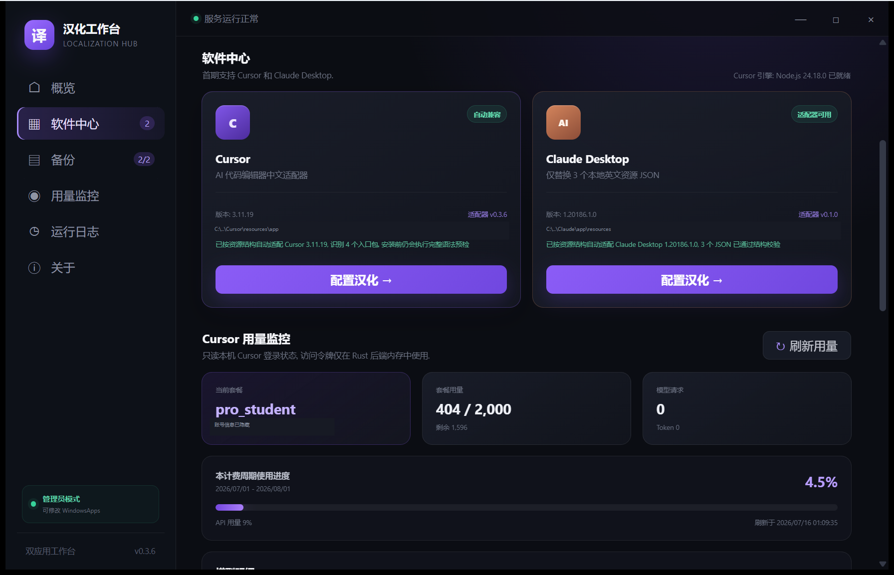
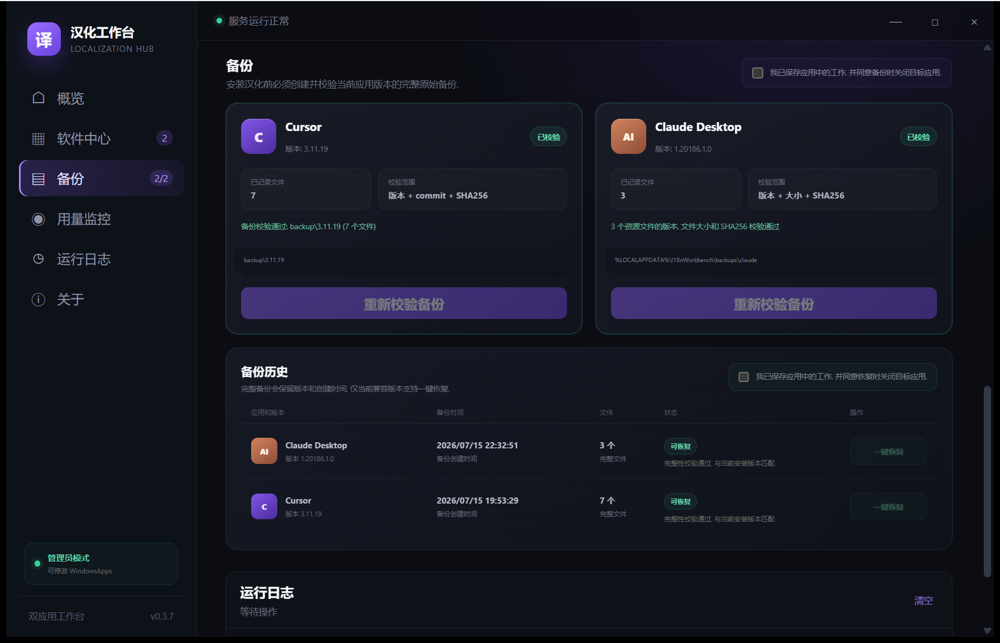
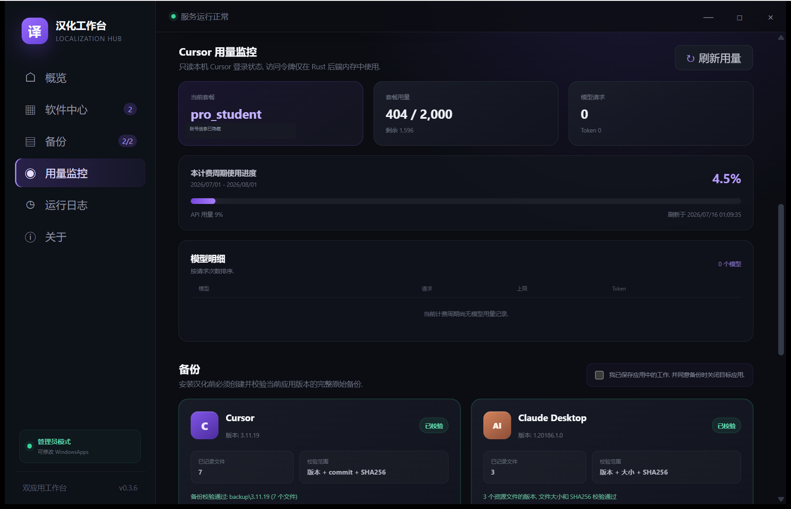
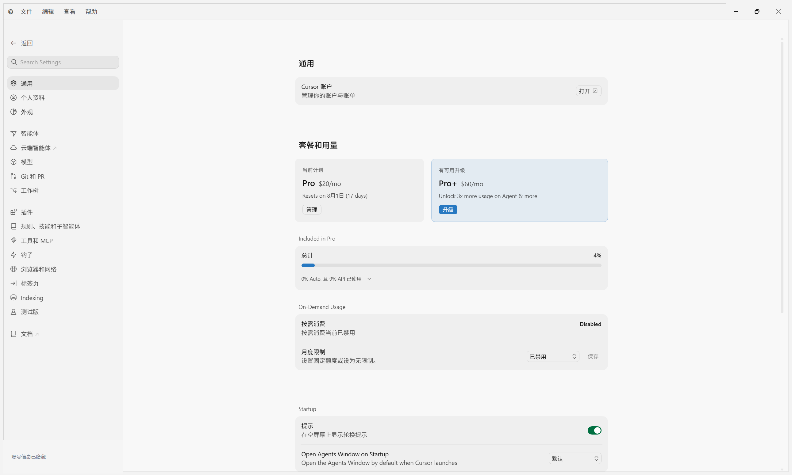
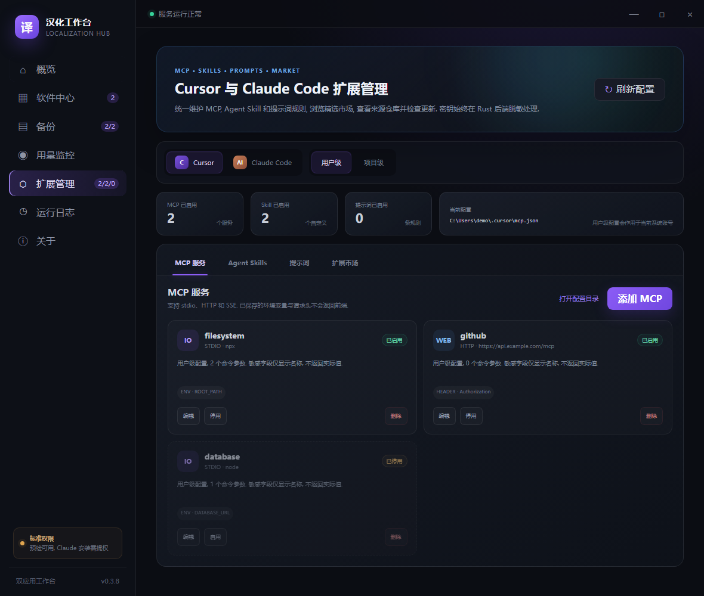

<div align="center">
  <h1>汉化工作台</h1>
  <p><strong>为 Cursor 和 Claude Desktop 提供安全, 可恢复, 可持续维护的中文本地化体验</strong></p>
  <p>版本识别 · 强制备份 · 一键汉化 · 原版恢复 · 用量监控 · MCP/Skill/提示词管理 · 扩展市场 · Windows/macOS</p>

  <p>
    <a href="https://github.com/svipm/cursor-i18n-zh/actions/workflows/build.yml"></a>
    <a href="https://github.com/svipm/cursor-i18n-zh/actions/workflows/cursor-compat.yml"></a>
    <a href="https://github.com/svipm/cursor-i18n-zh/releases"></a>
    <a href="LICENSE"></a>
  </p>

  <p>
    
    
    
    
    
  </p>

  <p>
    <a href="#界面预览">界面预览</a> ·
    <a href="#当前支持">支持范围</a> ·
    <a href="#下载和使用">下载使用</a> ·
    <a href="#备份和恢复">备份恢复</a> ·
    <a href="#新版本自动兼容">自动兼容</a> ·
    <a href="#资源来源和许可证">资源说明</a>
  </p>
</div>

> [!IMPORTANT]
> 本项目是第三方开源工具, 与 Cursor, Anthropic 和 Microsoft 没有从属或授权关系. 安装汉化会修改本机应用资源文件, 请先保存正在进行的工作, 并确认你有权修改对应软件.

## 🌟 社区鸣谢

<p align="center">
  <a href="https://linux.do">
    
  </a>
</p>

<p align="center"><strong>学 AI, 上 L 站! 祝L站越来越好~</strong></p>

## 界面预览

<p align="center">
  <a href="assets/screenshots/workbench-software-center.png">
    
  </a>
</p>
<p align="center"><strong>软件中心</strong><br><sub>自动识别 Cursor 和 Claude Desktop, 展示版本, 运行环境, 适配状态和备份状态.</sub></p>

<table>
  <tr>
    <td width="50%" align="center" valign="top">
      <a href="assets/screenshots/workbench-backups.png"></a><br>
      <strong>备份历史和一键恢复</strong><br>
      <sub>记录软件版本, 创建时间, 文件数量和完整性状态, 仅允许恢复当前匹配版本.</sub>
    </td>
    <td width="50%" align="center" valign="top">
      <a href="assets/screenshots/workbench-usage.png"></a><br>
      <strong>Cursor 用量监控</strong><br>
      <sub>展示套餐, 计费周期, 请求数, Token 和模型用量, 登录令牌不会传入前端.</sub>
    </td>
  </tr>
</table>

<p align="center">
  <a href="assets/screenshots/cursor-localized-settings.png">
    
  </a>
</p>
<p align="center"><strong>Cursor 中文设置和套餐用量</strong><br><sub>截图基于 Cursor 3.11.19, 账号身份和本机路径信息已经遮挡.</sub></p>

<p align="center">
  <a href="assets/screenshots/workbench-extensions.png">
    
  </a>
</p>
<p align="center"><strong>MCP 与 Agent Skills 扩展管理</strong><br><sub>统一管理 Cursor 和 Claude Code 的用户级或项目级配置, 密钥和请求头始终脱敏显示.</sub></p>

## 当前支持

### Cursor

- 支持简体中文 `zh-cn` 和繁體中文 `zh-tw`.
- 合并 Microsoft 官方 VS Code 中文语言包与项目词典.
- 自动发现已知入口和新增的 `out/vs/workbench/workbench.*.js` 大型入口包.
- 在写入前生成完整补丁计划, 校验 JavaScript 语法, NLS 占位符和词典歧义.
- 将 Cursor 原生套餐和用量区域保留在账号设置中, 并提供独立用量监控页.

### Claude Desktop

- 支持简体中文.
- 只修改以下 3 个英文资源 JSON, 不修改 `Claude.exe`, `app.asar`, 客户端配置或账号数据:

```text
app/resources/en-US.json
app/resources/ion-dist/i18n/en-US.json
app/resources/ion-dist/i18n/dynamic/en-US.json
```

- 内嵌 19276 条简体中文翻译记忆, 安装前统计命中并校验生成 JSON.

### Cursor 与 Claude Code 扩展管理

- 管理 Cursor 和 Claude Code 的用户级或项目级 MCP, 支持 stdio、HTTP 和 SSE.
- 支持添加、编辑、启用、停用和删除 MCP 服务, 并可真实启动 stdio 服务或请求 HTTP/SSE 端点执行 MCP `initialize` 健康检测.
- 管理 `~/.cursor/skills`, `~/.claude/skills` 以及项目内 `.cursor/skills`, `.claude/skills`.
- Cursor 内置 `skills-cursor` 和自动发现的 Claude 兼容 Skill 只读展示, 防止误删上游资源.
- 支持创建和编辑 `SKILL.md`, 停用时移动到独立目录, 删除时移动到工作台回收目录.
- 新增提示词规则管理. Cursor 项目规则使用 `.cursor/rules/*.mdc`; Claude Code 项目规则和官方个人规则使用 `.claude/rules/*.md`.
- Cursor 全局 User Rules 由 `Customize > Rules` 管理且没有公开文件格式. 工作台不会修改 Cursor 私有数据库, 在用户级作用域会明确提示切换到项目级.
- 新增精选扩展市场, 可以浏览并安装 MCP, Skill 和提示词模板.
- 市场项目显示官方、已验证社区或社区来源及许可证. 安装会固定到实际 GitHub 提交并记录完整内容哈希.
- 已安装项目可以打开对应仓库并检查更新. 如果内容已被本地修改, 默认拒绝市场覆盖, 只有用户明确确认后才允许更新.
- Skill 市场按固定 GitHub 提交递归下载完整 Skill 子目录, 包括 `scripts`, `references` 和资源文件, 并限制文件数量与总大小.
- Skill 会检查 frontmatter、本地引用、脚本、网络访问、Shell 和外部进程能力, 展示风险等级、目录 SHA256 和来源固定状态.
- 每次扩展修改前创建包含 MCP, 完整 Skill 目录, 提示词和来源注册表的结构化快照, 显示 added/modified/deleted 差异并支持一键恢复.
- 支持搜索、状态与风险筛选、批量启停, 并在首页和导航中提示异常 MCP、高风险 Skill 或本地修改.
- 支持 Cursor 与 Claude Code 之间复制 MCP, Skill 和提示词, 自动转换目标格式; 支持脱敏配置包和明确警告的私密配置包导入导出.
- 私密配置包使用 Argon2id 派生密钥和 AES-256-GCM 认证加密, 密钥内容禁止以明文 JSON 导出; 错误密码或文件篡改会被拒绝.
- 扩展目标通过后端适配器描述清单向界面提供版本、说明及用户级或项目级能力, 为后续增加更多软件建立统一入口.
- 非市场安装但带有 GitHub 来源的项目也会展示仓库. 缺少已安装提交记录时显示“版本未知”, GitHub 请求失败时显示“检查失败”, 不伪报为最新.

## 核心能力

- 自动定位常见安装目录, 正在运行的进程路径和系统注册的最新安装版本.
- 安装汉化前强制创建当前版本原始备份, 没有有效备份时禁止安装.
- 记录软件版本, Cursor commit, 文件数量, 文件大小和 SHA256.
- 在备份历史中显示创建时间, 对应版本和完整性状态, 支持当前匹配版本一键恢复.
- 安装, 备份和恢复前自动结束目标应用完整进程树, 并等待文件锁释放.
- 使用暂存文件统一提交修改. 任一步写入或复验失败时自动回滚已经提交的文件.
- 在界面中检测 Node.js 版本, 管理员权限, 应用兼容状态和备份状态.
- 首次启动先显示软件声明与隐私说明. 用户同意前不扫描本机应用, 不读取用量, 不检查版本.
- 启动后可选检查 GitHub 最新正式版本. 用户可以手动下载官方 Release 更新包, 工作台会校验 SHA256 后打开所在目录, 不静默安装, 不强制更新.
- 更新包使用 64 KB 缓冲区流式写入磁盘并同步计算 SHA256, 不再把最大 250 MB 的安装包整体保存在内存中.
- 已下载且 SHA256 与当前 Release 清单一致的更新包会直接复用; 损坏缓存会重新下载并通过可回滚的原子替换提交.
- 关于页在下载过程中显示实时进度和当前阶段, 无 Content-Length 时仍显示累计下载 MB 数.
- GitHub 项目、扩展市场、版本检查和更新下载会对 HTTP 500/502/503/504、超时及短暂连接失败执行有限重试, 403/404 等永久错误不会重复请求.
- 在独立扩展管理页维护 Cursor 与 Claude Code 的 MCP, Skill 和提示词, 支持用户级与项目级作用域及 GitHub 更新检查.
- 扩展检查与市场安装显示统一进度反馈, 键盘支持 Esc 关闭弹窗和方向键切换 Tab, 并为焦点和减少动态效果提供无障碍适配.

## 下载和使用

从 [最新发行版](https://github.com/svipm/cursor-i18n-zh/releases/latest) 下载推荐的完整便携包:

```text
localization-workbench-v0.4.2-windows.zip
```

执行步骤:

1. 解压完整 ZIP, 不要只移动其中的 EXE.
2. 如果要汉化 Cursor, 先安装 Node.js 18 或更高版本.
3. 双击 `localization-workbench-v0.4.2.exe`.
4. 阅读并同意首次启动声明与隐私说明.
5. 打开“备份”页, 为目标应用创建并校验当前版本原始备份.
6. 打开“软件中心”, 选择目标语言并安装汉化.
7. 重新启动目标应用.

只使用 Claude Desktop 汉化时不需要 Node.js. Cursor 适配器会复用便携包中的 `src`, `dict` 和 `node_modules`, 并要求本机 Node.js 18+; 因此 Cursor 用户应下载完整便携包.

根目录仍保留 Cursor 终端入口:

- `Cursor汉化助手.cmd`: 打开安装和恢复菜单.
- `一键安装汉化.cmd`: 进入安装流程.
- `还原默认.cmd`: 进入恢复流程.

## 备份和恢复

- 为每个软件版本创建独立且不可覆盖的原始备份.
- 在创建备份前检查来源文件. 如果文件已经汉化或被其他工具修改, 停止创建错误备份.
- 在安装和恢复前重新验证备份身份, 版本, 文件数量, 文件大小和 SHA256.
- 软件升级后要求为新版本重新创建备份. 历史备份只保留查看, 禁止恢复到不同版本.
- Cursor 备份保存在项目的 `backup/<Cursor版本>`.
- Claude Desktop 备份保存在 `%LOCALAPPDATA%\I18nWorkbench\backups\claude`.
- 恢复 Cursor 时同时恢复安装前的 locale 和语言包状态.

## 新版本自动兼容

工作台已经实现安全的自动兼容, 核心原则是“按结构识别, 按版本隔离备份, 结构异常时停止写入”.

Cursor 适配流程:

1. 动态读取当前 `product.json` 中的版本和 commit.
2. 自动定位安装目录并扫描 `workbench.*.js` 入口包, 不依赖固定 Cursor 版本号.
3. 按当前版本重新生成目标清单和补丁计划.
4. 在安装前完成 JavaScript 语法, NLS, checksum 和备份完整性校验.

GitHub 自动兼容流程:

1. `cursor-compat.yml` 每 6 小时读取 Cursor 官方稳定版下载接口.
2. 检测到 version 或 commit 变化后, 在隔离的 Windows Runner 中下载并静默安装官方安装包.
3. 校验安装包 Authenticode 签名, 实际安装版本和官方 commit, 然后执行完整 Node.js 测试及简繁双语言补丁预检.
4. 将代码替换量, 工作台入口数量, 账号用量入口和 Cursor NLS 命中量与上一兼容版本比较, 并导出新版本 UI 文案候选清单. 低于安全门限时停止构建并自动创建 GitHub Issue.
5. 全部通过后构建 EXE, 完整便携包和 SHA256 文件并上传为 Actions Artifact, 同时上传兼容性报告和文案扫描结果, 然后记录新的稳定版兼容基线.

该流程只生成待验证构建产物, 不会自动创建正式 GitHub Release. 正式发布仍需项目版本号, 更新日志和 `v*` 标签.

Claude Desktop 适配流程:

1. 读取系统已注册安装包并选择最新版本.
2. 只接受同时存在 3 个目标 JSON 的安装目录.
3. 验证 JSON 结构和可翻译字符串后才允许备份与安装.
4. 为当前包版本创建独立备份, 禁止将旧版本备份恢复到新版本.

自动兼容可以覆盖资源结构保持一致的大多数升级. 如果上游移动资源, 改变 JSON 结构或不再提供可补丁入口, 界面会显示“结构待适配”并阻止安装. 这种安全停止是预期行为, 不能承诺上游任意架构重写后仍无需更新适配器或词典.

### macOS

macOS 构建由 GitHub Actions 的 `macos-14` Runner 生成:

- `localization-workbench-v0.4.2-macos.dmg`: 推荐安装包.
- `localization-workbench-v0.4.2-macos-app.zip`: 保留完整 `.app` 的便携压缩包.
- 默认构建 Universal Binary, 同时包含 Apple Silicon `arm64` 和 Intel `x86_64`.
- 从 Finder 启动时会定位 PATH, Homebrew, NVM, Volta, asdf, mise 和 fnm 中的 Node.js, 并使用检测到的实际可执行文件运行 Cursor 引擎.
- 自动定位 `/Applications/Cursor.app/Contents/Resources/app` 和 `/Applications/Claude.app/Contents/Resources`.
- 安装和恢复前自动退出目标应用. 修改应用资源后按 Mach-O 文件, Framework, Helper App 和外层 `.app` 的顺序逐层执行本机 ad-hoc 重签名, 保留各组件 entitlement 并清除隔离属性.
- Claude Desktop 重签名会移除 ad-hoc 签名无法使用的 Team ID 和 Keychain Group entitlement, 增加本机库加载许可, 并强制验证原有虚拟化 entitlement 没有丢失.
- 管理员启动时保留原用户 HOME, UID 和 GID. 用户级配置与备份写入后恢复原用户所有权, 避免产生 root 所有文件.
- `.app` 内置 Cursor 引擎依赖及对应第三方许可证, Claude 翻译资源来源和 Apache-2.0 声明与 Windows 便携包保持一致.

当前 Windows 主机无法运行 macOS 应用. 仓库通过目标平台条件编译和 `macos-14` 原生 CI 完成 Universal 构建, 双架构检查, Info.plist 校验, `.app` 签名校验, ZIP 完整性检查和 DMG 挂载结构验证. 配置 Apple 开发者证书与公证 Secrets 后会自动执行 Developer ID 签名, notarization, stapling 和 Gatekeeper 验证; 未配置时生成 ad-hoc 签名测试产物. 正式发布前仍应在真实 Mac 上执行一次 Cursor 与 Claude Desktop 安装、恢复和启动验收.

## MCP, Skill 与提示词安全

- Cursor 用户级 MCP: `%USERPROFILE%\.cursor\mcp.json`.
- Claude Code 用户级 MCP: `%USERPROFILE%\.claude.json`.
- Cursor 项目级 MCP: `<工作区>\.cursor\mcp.json`.
- Claude Code 项目级 MCP: `<工作区>\.mcp.json`.
- MCP 环境变量、HTTP 请求头和 URL 凭据不会以明文返回前端, 编辑时使用 `••••••` 保留原值, 健康检测诊断同样不会输出密钥.
- MCP 的 GitHub 来源和安装提交记录保存在工作台独立 `extension-registry` sidecar, 不向 Cursor 或 Claude 的标准 MCP 对象添加私有字段.
- 配置修改前完整快照保存到 `%LOCALAPPDATA%\I18nWorkbench\extension-history`, 最多保留 100 条; 恢复前会先快照当前状态.
- 停用 MCP 会将完整配置移动到独立的 `mcp.disabled.json`, 密钥不会经过前端或日志.
- 删除 Skill 不会直接销毁目录, 而是移动到 `%LOCALAPPDATA%\I18nWorkbench\extension-trash`.
- Windows 工作台数据位于 `%LOCALAPPDATA%\I18nWorkbench`, macOS 位于 `~/Library/Application Support/I18nWorkbench`.
- 提示词停用时移动到独立目录, 删除时同样进入工作台回收目录.
- 市场只接受清单内经过校验的 GitHub 仓库首页和 GitHub Raw Skill 地址. 内容写入和来源登记在同一个可回滚事务内, MCP 密钥不会进入市场请求.
- 为防止目录逃逸和不完整备份, Skill 审计、迁移和历史快照拒绝跟随符号链接.
- 脱敏配置包不会写入密钥. 私密配置包使用 `.iwbundle` 格式, 通过 Argon2id 和 AES-256-GCM 加密 MCP 环境变量及请求头; macOS 和 Linux 同时将文件权限限制为 `0600`.
- 配置包密码不会写入日志或落盘. 密码至少需要 10 个 UTF-8 字节, 丢失后无法恢复; 加密包被修改或密码错误时认证解密会失败.
- 派生密钥和加解密明文缓冲区在完成操作后主动清零, 减少敏感内容在工作台内存中的残留时间.
- v0.3.9 及更早版本产生的明文私密 JSON 仍可导入用于迁移, 但界面会明确警告并建议导入后立即删除源文件.

## Cursor 用量与隐私

- 只读 `%APPDATA%\Cursor\User\globalStorage\state.vscdb` 中的 Cursor 登录状态.
- 登录凭据只保存在 Rust 后端内存中, 只发送给 Cursor 官方用量接口.
- 前端只接收套餐, 计费周期, 请求数, Token 数和模型用量结果.
- 不把登录令牌返回 JavaScript, 不写日志, 不落盘, 不上传个人文件.
- GitHub 版本检查只发送公开发行版请求, 不携带 Cursor 或 Claude 账号信息.

## 命令行和开发验证

要求 Node.js 18+ 和 Rust stable. Windows 产物在 Windows 构建, macOS `.app` 与 DMG 必须在 macOS 构建.

```powershell
npm ci
npm test
npm run security-check
npm run dict-check
npm run check -- --locale zh-cn
npm run check -- --locale zh-tw
npm run compat-check -- --locale zh-cn
cargo test --locked --manifest-path desktop-sample/src-tauri/Cargo.toml
```

常用 Cursor 命令:

```powershell
npm run locate
npm run status
npm run backup
npm run backup-check
npm run patch-install -- --locale zh-cn
npm run restore
```

构建发布产物:

```powershell
npm run package
cargo build --release --locked --manifest-path desktop-sample/src-tauri/Cargo.toml
npm run package-desktop
```

GitHub Actions 会并行执行 Windows 与 macOS 测试和构建. Windows 生成 EXE 与便携 ZIP, macOS 生成 `.app.zip` 与 DMG, 两个平台分别生成 SHA256. 发布前执行敏感信息扫描. 配置 `WINDOWS_CERTIFICATE` 和 `WINDOWS_CERTIFICATE_PASSWORD` 后会执行 Windows Authenticode SHA256 签名与时间戳校验. `cursor-compat.yml` 额外监控 Cursor 官方稳定版并自动生成兼容性构建. 推送 `v*` 标签时自动合并两个平台产物并创建 GitHub Release.

## 发布产物

- `localization-workbench-v0.4.2-windows.zip`: Windows 推荐下载, 包含工作台 EXE, Cursor 引擎, 词典, Node.js 依赖, README 和第三方许可证.
- `localization-workbench-v0.4.2.exe`: Windows 单文件 GUI. Claude Desktop 功能可独立运行; Cursor 功能仍需要完整便携包和 Node.js 18+.
- `localization-workbench-v0.4.2-macos.dmg`: macOS 推荐安装包.
- `localization-workbench-v0.4.2-macos-app.zip`: macOS `.app` 便携包, 内含 Cursor 汉化引擎和运行依赖.
- `cursor-i18n-zh-windows.zip`: Cursor 终端版和传统入口.
- `SHA256SUMS.txt`: 所有发布文件的 SHA256 校验值.

## 资源来源和许可证

实际内嵌或随包分发的第三方资源:

- [Stack-Cairn/LiveAgent](https://github.com/Stack-Cairn/LiveAgent): LINUX DO 社区宣传图来源. 本仓库基于固定提交 `bca31978de9e23501c618f0fa4dca38d2e69f202` 保存原图到 `assets/community/linuxdo.png`, README 使用仓库内相对路径引用. 来源仓库使用 MIT License, LINUX DO 名称与标识归其权利人所有.
- [GMYXDS/claude-desktop-zh-simple](https://github.com/GMYXDS/claude-desktop-zh-simple): Claude Desktop 简体中文翻译记忆来源. 本项目固定内嵌快照 `20260711180535`, 共 19276 条映射, 遵守 Apache-2.0. 来源说明和完整许可证保存在 `desktop-sample/resources/claude/SOURCE.md` 与 `desktop-sample/resources/claude/APACHE-2.0.txt`.
- [Acorn](https://github.com/acornjs/acorn): JavaScript 语法分析运行时, MIT.
- [OpenCC-JS](https://github.com/nk2028/opencc-js): 简繁转换运行时, MIT 与 Apache-2.0. OpenCC 字典数据遵守 Apache-2.0.
- [Tauri](https://github.com/tauri-apps/tauri): 桌面 GUI 框架, MIT 或 Apache-2.0.
- `ureq`, `rusqlite`, `Serde`, `AES-GCM`, `Argon2`, `RustCrypto hashes` 等 Rust 依赖: 具体版本由 `desktop-sample/src-tauri/Cargo.lock` 固定.
- Microsoft 官方中文语言包 `ms-ceintl.vscode-language-pack-zh-hans` 和 `ms-ceintl.vscode-language-pack-zh-hant`: 仅通过 Cursor CLI 按需安装或读取, 本仓库和 Release 不重新分发其内容.
- 扩展市场引用 [microsoft/playwright-mcp](https://github.com/microsoft/playwright-mcp), [upstash/context7](https://github.com/upstash/context7), [modelcontextprotocol/servers](https://github.com/modelcontextprotocol/servers) 和 [anthropics/skills](https://github.com/anthropics/skills). 仓库只保存安装清单, 不内嵌这些项目的程序包; 用户主动安装时从 npm 或 GitHub Raw 获取, 使用时遵守各来源仓库许可证.

仅用于实现调研和设计参考, 未复制其代码, 图标, 翻译文件或发行资源:

- [javaht/claude-desktop-zh-cn](https://github.com/javaht/claude-desktop-zh-cn): Claude Desktop 资源定位, 备份和恢复流程参考.
- [bjrzs/Cursor_chinese](https://github.com/bjrzs/Cursor_chinese): Cursor 本机登录状态和用量查询思路参考.
- [Stack-Cairn/LiveAgent](https://github.com/Stack-Cairn/LiveAgent): 桌面 GUI 信息架构, README 排版和社区鸣谢展示形式参考, MIT.
- [desktop-cc-gui](https://github.com/zhukunpenglinyutong/desktop-cc-gui): 桌面 GUI 交互形式调研参考, MIT.

完整第三方说明见 [THIRD_PARTY_LICENSES](THIRD_PARTY_LICENSES). 项目自身代码使用 [MIT License](LICENSE). Cursor, Claude, Microsoft, Anthropic 及相关名称和商标归各自权利人所有.

## 已知边界

- macOS 代码和原生构建工作流已经完成, 但当前维护环境没有真实 Mac, 正式发布前仍需完成真机安装与恢复验收.
- Cursor 专有新功能和新文案可能出现英文残留, 需要继续更新 `dict/*.json`.
- 上游发生破坏性资源结构变更时, 自动兼容会安全停止并等待适配器更新.
- Cursor 汉化需要 Node.js 18+; 安装官方语言包时需要网络.
- 修改 `Program Files`, `WindowsApps` 或 `/Applications` 下的资源需要管理员权限. macOS 修改后会执行 ad-hoc 重签名.
- 本项目不绕过登录, 订阅, 授权或任何网络服务限制.

完整版本记录见 [CHANGELOG.md](CHANGELOG.md).
