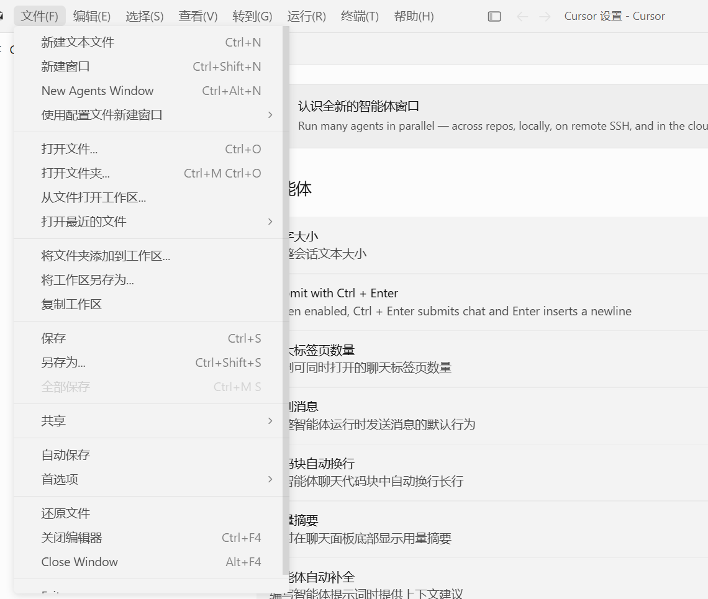
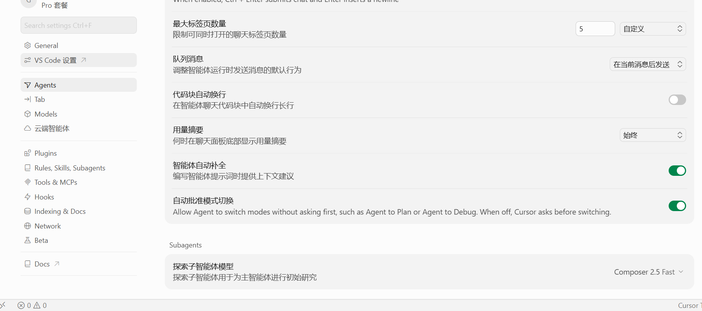

# cursor-i18n-zh

[](https://github.com/svipm/cursor-i18n-zh/actions/workflows/build.yml)
[](https://github.com/svipm/cursor-i18n-zh/releases)
[](LICENSE)

Windows 桌面软件汉化工作台. `v0.3.6` 首期支持 Cursor 和 Claude Desktop, 提供软件检测, 强制备份, SHA256 校验, 汉化安装, 原版恢复, Cursor 用量监控和可选更新检查.

本项目是第三方开源工具, 不是 Cursor 或 Anthropic 官方项目. 汉化会修改本机应用资源文件, 安装前必须创建并校验当前版本原始备份.

## 使用声明

桌面 GUI 首次启动时必须勾选同意软件声明和隐私说明, 同意前不会扫描本机应用, 读取 Cursor 用量或检查更新. 终端菜单仍要求完整输入下面这句话:

```text
我已仔细阅读上述规则并同意继续使用
```

声明要点:

- 本软件仅供学习, 研究和个人本地化测试使用.
- 本软件不是 Cursor 或 Anthropic 官方项目, 与两家公司均无从属或授权关系.
- 使用前请确认你有权在自己的电脑上修改本机软件文件.
- 安装汉化会修改 Cursor 或 Claude Desktop 的本地资源文件.
- 安装, 备份和恢复会自动关闭目标应用, 请提前保存未完成工作.
- 目标应用升级后可能需要重新安装汉化, 也可能出现部分英文残留.
- 汉化功能不收集或上传个人文件. GUI 的 Cursor 用量监控会只读本机登录状态, 并仅向 Cursor 官方接口发送当前会话凭据以查询账户用量; 凭据不会返回前端, 不写日志, 不写入工作台文件.
- 因使用本软件造成的兼容性问题, 文件损坏或其他风险, 由使用者自行承担.

## 快速开始

打开最新发行版:

```text
https://github.com/svipm/cursor-i18n-zh/releases/latest
```

桌面 GUI 推荐步骤:

1. 安装 Node.js 18 或更高版本.
2. 下载 `localization-workbench-v0.3.6-windows.zip`.
3. 解压到任意目录.
4. 双击 `localization-workbench-v0.3.6.exe`.
5. 阅读并同意首次启动声明和隐私说明.
6. 在“备份”页为目标应用创建并校验当前版本备份.
7. 在“软件中心”选择应用并安装汉化.

只使用 Claude Desktop 汉化时不需要 Node.js. Cursor 汉化依赖便携包中的 `src`, `dict`, `node_modules` 和本机 Node.js 18+, 因此不建议只下载单独 EXE 后移出便携包运行.

## 桌面 GUI

仓库中的 `desktop-sample` 使用 Tauri 2, 原生 HTML/CSS/JavaScript 和 Rust 实现, 首期支持:

- Cursor: 复用本项目现有 CLI 引擎, 支持简体中文, 繁體中文, 安全预检, 安装和恢复.
- Claude Desktop: 只修改 `app/resources` 下 3 个 `en-US.json`, 不修改 `app.asar`, `Claude.exe` 或客户端配置.
- 统一的软件检测, 目标语言选择, 实时进度, 运行日志, 独立备份选项卡和恢复入口.
- Cursor 和 Claude Desktop 安装汉化前必须先创建并校验当前版本完整备份, 前端和 Rust 后端都会执行门禁.
- 备份历史会显示创建时间, 对应软件版本, 文件数量和完整性状态; 当前版本且校验通过的记录支持一键恢复原版.
- Cursor 用量监控会显示套餐, 计费周期, 总用量, 剩余用量, 请求数, Token 数和模型明细.
- Claude Desktop 的 19276 条简体中文翻译记忆库内嵌在 EXE 中, 来源和许可见 `desktop-sample/resources/claude`.
- 首次启动必须阅读并同意软件声明和隐私说明, 同意前不会扫描本机软件或发起联网检查.
- “关于”作为独立页面显示 GitHub 头像, 项目地址, 可选更新状态和完整声明入口.
- 新版本不按固定版本号白名单判断. 工作台会自动定位最新安装, 按资源结构识别入口文件并显示兼容状态.

桌面 GUI 从 `v0.3.6` 起作为正式 Release 产物发布. 本地构建和运行条件见 `desktop-sample/README.md`, 完整版本记录见 `CHANGELOG.md`.

## 新版本自动兼容

- Cursor: 自动读取当前 `product.json` 版本, 扫描已知入口和新增的 `out/vs/workbench/workbench.*.js` 大型入口包, 不依赖固定 Cursor 版本号.
- Claude Desktop: 自动选择系统当前注册的最新安装版本, 校验 3 个目标 JSON 的存在性, JSON 结构和可翻译字符串, 不回退修改旧版本目录.
- 版本升级后必须为新版本重新创建独立备份, 历史版本备份禁止恢复到当前版本.
- 安装前始终执行无写入预检. Cursor 会生成完整补丁计划并做 JavaScript 语法校验; Claude 会统计翻译命中并验证生成 JSON.
- 如果上游移动资源, 改变 JSON 结构或不再存在可补丁入口, 界面会显示“结构待适配”并停止安装, 不会盲目写入.

自动兼容可以覆盖资源结构保持一致的大多数新版本, 但无法承诺上游任意架构重写后仍无需更新词典或适配器.

## 发布产物

- `localization-workbench-v0.3.6-windows.zip`: 推荐下载. 包含桌面 EXE, Cursor 引擎, 词典, Node.js 运行依赖, README 和第三方许可证.
- `localization-workbench-v0.3.6.exe`: 单文件 GUI. Claude Desktop 功能可独立运行; Cursor 功能仍需要完整便携包和 Node.js 18+.
- `cursor-i18n-zh-windows.zip`: 保留的 Cursor 终端版和传统入口.
- `SHA256SUMS.txt`: 上述发布文件的 SHA256 校验值.

## v0.3.6 更新说明

- 修复 Claude Desktop 备份已经成功并通过校验后, 前端因引用未定义变量而误报失败的问题.
- GitHub 更新检查和 Cursor 用量接口改用 Windows 系统受信任证书链及系统代理, 保持完整 TLS 证书校验.
- “关于”改为独立页面, 按需加载 GitHub 头像, 不再与主工作区纵向混排.
- 新增首次启动软件声明和隐私说明. 用户明确同意前, 不执行应用扫描、用量读取或版本检查.
- 关于页新增完整声明与隐私说明的重新查看入口.

## v0.3.5 更新说明

- Cursor 安装、恢复和备份操作会自动强制结束完整进程树并等待退出, 无需手动关闭残留窗口或子进程.
- GUI 的安装和恢复成功状态统一改为对应按钮显示“完成”.
- 新增“关于”选项卡, 展示项目 GitHub、版本、图标和安全声明.
- 启动时后台读取 GitHub 最新正式发行版, 仅提示可选更新, 禁止自动下载、静默安装和强制更新.

## v0.3.4 更新说明

- GUI 新增 Node.js 18+ 可视化检测, 显示版本、程序路径和不兼容原因.
- EXE 本身及 Claude Desktop 汉化不依赖 Node.js, 只有 Cursor 适配器在 Node.js 未就绪时禁用.
- 重新扫描软件时同步刷新 Node.js 运行环境.

## v0.3.3 更新说明

- 修复 Cursor 设置页大量已有词典文案未在 UI 属性上下文中生效的问题.
- 扩充 Cursor 设置导航和用量页词典, 并保持简体、繁体同步转换.
- 将 Cursor 原生“套餐和用量”组件嵌入账号信息区域, 不向 Cursor 注入额外登录令牌或第三方请求.
- GUI 安装成功后的主按钮改为“完成”, 软件卡片同步显示“汉化已完成”.

## v0.3.2 更新说明

- 新增 Cursor 用量监控界面, 显示套餐用量, 计费周期, 请求数, Token 数和模型明细.
- 新增统一备份历史列表, 显示备份时间, 软件版本, 文件数量和 SHA256 完整性状态.
- 新增备份列表一键恢复, 仅允许当前软件版本且完整性校验通过的备份执行恢复.
- 修复 Cursor CLI 已成功卸载中文语言包, 但扩展目录延迟清理导致恢复原版误报失败的问题.
- 新增 Claude Desktop 轻量汉化适配器, 只修改 3 个 `en-US.json` 并强制执行安装前完整备份门禁.

恢复原版:

1. 双击根目录的 `还原默认.cmd`, 或打开 `Cursor汉化助手.cmd` 后选择 `2. 还原成默认`.
2. 阅读声明, 完整输入同意文字.
3. 确认恢复.
4. 工具会事务化恢复 Cursor 文件和安装前的语言设置; 如果语言包由本工具安装, 也会将其卸载.
5. 重新打开 Cursor.

## 效果图





## 根目录入口

发行版 zip 解压后, 根目录会直接提供这些可双击文件:

- `Cursor汉化助手.cmd`: 推荐入口. 打开终端菜单, 先展示声明, 再显示 `1. 安装汉化`, `2. 还原成默认`.
- `一键安装汉化.cmd`: 直接进入安装流程, 仍会先展示声明并要求输入同意文字.
- `还原默认.cmd`: 直接进入恢复流程, 仍会先展示声明并要求输入同意文字.

`scripts` 目录保留为开发和备用入口:

- `scripts\gui.cmd`: 图形界面, 支持语言选择, 一键安装, 一键恢复.
- `scripts\cursor-i18n-helper.cmd`: 终端菜单, 先展示声明, 再显示 `1. 安装汉化`, `2. 还原成默认`.
- `scripts\install.cmd`: 终端安装入口, 会进入声明和语言选择流程.
- `scripts\restore.cmd`: 终端恢复入口, 会进入声明流程.
- `scripts\status.cmd`: 查看当前 Cursor 路径, 备份, 文件修改状态和语言包状态.

## 为什么同时提供 EXE 和便携包

桌面 GUI 本身编译为单个 EXE, 但 Cursor 适配器继续复用仓库中经过测试的 Node.js 引擎. 推荐使用便携包的原因是:

- Cursor 的词典, 源码和事务化备份逻辑可以直接审计.
- `src`, `dict`, `node_modules`, README 和许可证与 EXE 一起分发, 不需要联网下载脚本.
- Claude Desktop 翻译记忆库已内嵌在 EXE 中, 可独立执行预检, 备份, 安装和恢复.

终端用户仍可下载 `cursor-i18n-zh-windows.zip`, 双击根目录的 `Cursor汉化助手.cmd`.

## 命令行

需要 Node.js 18 或更高版本.

```powershell
npm run locate
npm run status
npm run check
npm run dict-check
npm run patch-install -- --locale zh-cn
npm run lang
npm run apply
npm run restore
npm test
```

指定语言:

```powershell
npm run check -- --locale zh-cn
npm run patch-install -- --locale zh-cn

npm run check -- --locale zh-tw
npm run patch-install -- --locale zh-tw
```

可用语言:

- `zh-cn`: 简体中文, 使用官方 `ms-ceintl.vscode-language-pack-zh-hans` 语言包.
- `zh-tw`: 繁體中文, 优先使用官方 `ms-ceintl.vscode-language-pack-zh-hant` 语言包; 如果本机未安装, 会尝试使用简体语言包内容并转换为繁体.

## 自动定位 Cursor

工具会自动寻找 Cursor 的 `resources/app` 目录, 支持这些来源:

- `%LOCALAPPDATA%\Programs\cursor\resources\app`
- `%ProgramFiles%\Cursor\resources\app`
- `%ProgramFiles(x86)%\Cursor\resources\app`
- `PATH` 中的 `cursor.cmd`, `cursor`, `Cursor.exe`
- 正在运行的 `Cursor.exe` 进程路径
- Windows 卸载注册表中的 Cursor 安装信息
- `CURSOR_APP_DIR` 或 `CURSOR_EXE` 环境变量

特殊安装目录可以手动指定:

```powershell
$env:CURSOR_APP_DIR = 'D:\Your\Cursor\resources\app'
npm run locate
```

查看全部探测来源:

```powershell
npm run locate -- --verbose
```

## 安全检查

`npm run check` 是严格预检, 不修改 Cursor. 定位失败, 目标缺失, 备份异常, 自定义 NLS 词典歧义, 占位符错误或补丁后语法错误都会返回非零状态并停止安装. 官方语言包自身的歧义项和占位符不一致项会跳过并报告. `npm run dict-check` 只校验词典, 供 CI 使用.

检查内容:

- 校验 `dict/*.json` 是否为合法 JSON.
- 校验译文是否包含高风险字符, 例如 `<`, `>`, 引号, 反斜杠和模板占位符.
- 自动定位 Cursor 安装目录.
- 检查当前版本可补丁目标是否存在.
- 校验自定义 `dict/nls.json` 的歧义和占位符错误; 跳过并报告官方语言包中同一 key 对应不同原文的歧义项, 以及占位符不一致项.
- 预生成全部补丁结果, 并使用 Node.js 语法检查器校验 JavaScript.

工作台入口包会自动发现: 除内置锚点目标 (`workbench.glass.main.js`, `workbench.desktop.main.js`, `workbench.anysphere-ui-automations.js`, `out/main.js`) 外, 还会扫描 `out/vs/workbench/` 下其它大体积 `workbench.*.js` 入口包, 兼容未来 Cursor 版本新增或改名的工作台包. 缺失的目标会自动跳过, 不存在的文件不会被备份也不会报错.

安装会修改的位置:

- Cursor 安装目录下的 `out/vs/workbench/*.js`, `out/main.js`, `out/nls.messages.json`, `product.json`.
- 当前用户的 `%USERPROFILE%\.cursor\argv.json`, 用于设置 `locale`.
- 当前用户的 `%APPDATA%\Cursor\clp`, 用于清理语言包缓存并让 Cursor 重建.

工具会保留 Cursor 默认 `argv.json` 中的 `//` 注释, 并按 JSONC 规则校验和写入 `locale`.

备份策略:

- 首次安装会把当前 Cursor 版本的原始文件保存到 `backup/<Cursor版本>/files`.
- `meta.json` 会记录 Cursor version, commit, 文件大小和 SHA256; 安装和恢复前都会重新校验.
- 创建新备份前会先校验来源文件; 如果当前 Cursor 已被汉化或已被其他工具修改, 会停止安装, 避免把汉化后的文件误备份成原版.
- 已存在的备份不会被覆盖, 避免把补丁后的文件误当作原版.
- 备份和正式文件均使用同目录临时文件提交; 中途失败会清理本轮新增内容.
- 当前版本不存在的文件会被跳过 (例如某些 Cursor 版本没有独立 `nls.messages.json`), 不会因文件缺失而中断备份或安装.
- 安装前会保存原始 locale 和语言包存在状态; `restore` 会与资源文件一起恢复.
- `apply` 和 `restore` 会先暂存并验证全部目标, 再统一提交; 任一替换失败会自动回滚已提交文件.
- 恢复前会检查备份内容; 如果备份本身已经包含汉化内容, 会停止恢复并提示先重装或更新 Cursor 后重新生成干净备份.

项目安全边界:

- 不下载或执行远程脚本.
- 汉化引擎不读取或上传无关个人数据.
- GUI 用量监控只读 `%APPDATA%\Cursor\User\globalStorage\state.vscdb` 中的 Cursor 登录状态, 凭据仅在 Rust 内存中用于请求 Cursor 自有用量接口, 不返回 JavaScript, 不写日志, 不落盘.
- 不修改无关目录.
- 不绕过 Cursor 登录, 订阅, 授权或网络服务.
- 所有替换词条来自 `dict/*.json`, 替换逻辑在 `src/engine.js` 和 `src/nls.js` 中, 可直接审计.

## 工作原理

安装流程:

1. 自动定位 Cursor 安装目录.
2. 读取 Cursor 版本和 `product.json`.
3. 在关闭 Cursor 前完成严格预检, 预生成全部补丁并校验语法.
4. 关闭 Cursor, 校验并备份当前版本原始文件.
5. 保存安装前的 locale 和语言包状态.
6. 安装对应官方中文语言包并设置 `argv.json` 的 locale.
7. 合并官方语言包和 `dict/nls.json`, 再生成代码层词典补丁.
8. 根据补丁结果更新 `product.json` 中已有 checksum.
9. 将全部结果暂存后统一提交; 任一步失败会回滚文件和本次用户状态修改.
10. 清理语言包缓存, 让 Cursor 重启后重新生成.

繁體中文模式下, 项目自定义简体词典始终会使用 `opencc-js` 的台湾繁体词组转换, 再应用项目内的技术术语覆盖. 官方语言包会优先使用原生 `zh-Hant`; 原生繁体内容不会二次转换. 只有本机没有 `zh-Hant` 而 fallback 到 `zh-Hans` 官方语言包时, 才会把官方简体内容转换为繁体.

## 维护词典

扫描当前 Cursor 版本候选文案:

```powershell
npm run scan
```

编辑规则:

- `dict/nls.json`: 使用 `模块路径#key` 作为键, 替换 `out/nls.messages.json`.
- 其他 JSON: 使用英文原文作为键, 译文可以是字符串, 也可以是 `{ "zh": "译文", "ctx": ["prop"] }`.
- `ctx` 只允许 `lit`, `prop`, `html-text`, `html-attr`.
- 译文不要包含 `<`, `>`, `"`, `'`, `` ` ``, `\`, `${...}`.

修改后运行:

```powershell
npm test
npm run check -- --locale zh-cn
npm run check -- --locale zh-tw
```

## 打包和发布

本仓库包含 GitHub Actions 工作流 `.github/workflows/build.yml`.

每次 push 或 pull request 会自动执行:

- `npm test`
- `npm run dict-check`
- `scripts/package.ps1`
- `cargo test --locked` 和 `cargo build --release --locked`
- `scripts/package-desktop.ps1`
- 解压发行包并运行 CLI 帮助命令做冒烟测试
- 上传终端 ZIP, 桌面 EXE, 桌面便携包和 SHA256 校验文件

推送 `v*` 标签时会自动创建 GitHub Release, 并上传终端 ZIP, 桌面 EXE, 桌面便携包和 SHA256 校验文件:

```powershell
git tag -a v0.3.6 -m "v0.3.6"
git push origin v0.3.6
```

只 push 到 `main` 不会生成发行版页面. 需要推送版本标签, Release 才会出现.

## 资源来源, 参考项目与许可证

实际内嵌或随包分发的第三方资源:

- [GMYXDS/claude-desktop-zh-simple](https://github.com/GMYXDS/claude-desktop-zh-simple): Claude Desktop 简体中文翻译记忆库的来源. 本项目固定内嵌版本 `20260711180535`, 共 19276 条映射, 只用于替换 3 个 `en-US.json` 的字符串值. 上游采用 Apache-2.0, 原始来源说明和完整许可证保存在 `desktop-sample/resources/claude/SOURCE.md` 与 `desktop-sample/resources/claude/APACHE-2.0.txt`.
- [Acorn](https://github.com/acornjs/acorn): JavaScript 语法分析运行时, MIT.
- [OpenCC-JS](https://github.com/nk2028/opencc-js): 简体和繁体中文转换运行时, MIT 与 Apache-2.0. 其 OpenCC 字典数据遵守 Apache-2.0.
- [Tauri](https://github.com/tauri-apps/tauri): 桌面 GUI 框架, MIT 或 Apache-2.0.
- [ureq](https://github.com/algesten/ureq), [rusqlite](https://github.com/rusqlite/rusqlite), [Serde](https://github.com/serde-rs/serde), [RustCrypto hashes](https://github.com/RustCrypto/hashes): 桌面后端使用的 Rust 依赖. 具体版本由 `desktop-sample/src-tauri/Cargo.lock` 固定.
- Microsoft 官方中文语言包 `ms-ceintl.vscode-language-pack-zh-hans` 和 `ms-ceintl.vscode-language-pack-zh-hant`: 仅通过 Cursor CLI 按需安装或读取, 本仓库和 Release 不重新分发语言包内容.

仅用于实现调研和设计参考, 未复制其代码, 图标, 翻译文件或发行资源:

- [javaht/claude-desktop-zh-cn](https://github.com/javaht/claude-desktop-zh-cn): Claude Desktop 资源定位, 备份和恢复流程参考.
- [bjrzs/Cursor_chinese](https://github.com/bjrzs/Cursor_chinese): Cursor 本机登录状态和用量查询思路参考.
- [Stack-Cairn/LiveAgent](https://github.com/Stack-Cairn/LiveAgent) 与 [desktop-cc-gui](https://github.com/zhukunpenglinyutong/desktop-cc-gui): 桌面 GUI 信息架构和交互形式调研参考, 两者均采用 MIT.

完整第三方说明见 `THIRD_PARTY_LICENSES`. Cursor, Claude, Microsoft, Anthropic 及相关名称和商标归各自权利人所有.

社区鸣谢:

- LINUX DO: <https://linux.do>. 感谢社区的支持与讨论.

## 已知边界

- Cursor 每个版本的前端产物可能变化, 新版本可能出现英文残留.
- 顶部菜单和 VS Code 设置主要依赖官方语言包与内置 NLS 合并.
- Cursor 专有新功能需要持续补充 `dict/*.json`.
- 同一 NLS key 对应不同英文原文时会跳过该官方语言包词条, 避免错误覆盖.
- 安装官方语言包需要网络; 发行包仍要求本机已有 Node.js 18 或更高版本.
